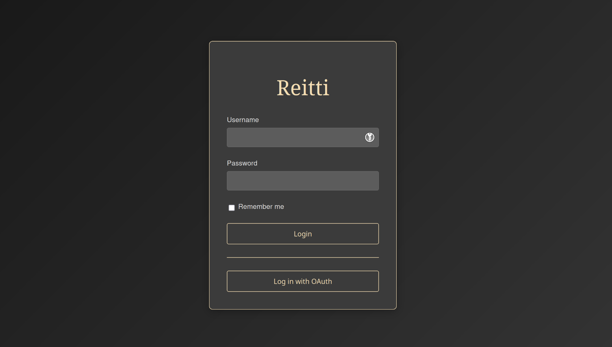

> [!WARNING]  
> To prevent an issue where the photon service downloads the entire planet's data (a very large file!), please update your docker-compose.yml file. This affects users who set up Reitti using our Docker Compose file before 2025-09-08. The photon service has renamed the COUNTRY_CODE variable to REGION.
> What to do:
> - Option A: Download the latest docker-compose.yml from the repository.
> - Option B: Manually edit your existing docker-compose.yml and change the COUNTRY_CODE environment variable to REGION in the photon service definition.
> For more details, you can see the exact changes in this [commit](https://github.com/dedicatedcode/reitti/commit/b2416892a48c15793a39d11c305b500c2077a9d3). We recommend making this change before you next pull any images.


Reitti is a comprehensive personal location tracking and analysis application that helps you understand your movement patterns and significant places. The name "Reitti" comes from Finnish, meaning "route" or "path".

## Features

### Main View


### Multiple Users View


### Statistics View


### Login page



### Core Location Analysis
- **Visit Detection**: Automatically identify places where you spend time
- **Trip Analysis**: Track your movements between locations with transport mode detection (walking, cycling, driving)
- **Significant Places**: Recognize and categorize frequently visited locations with custom naming
- **Timeline View**: Interactive daily timeline showing visits and trips with duration and distance information
- **Raw Location Tracking**: Visualize your complete movement path with detailed GPS tracks
- **Multi-User-View**: Visualize all your family and friends on a single map
- **Live-Mode**: Visualize incoming data automatically without having to reload the map 
- **Fullscreen-Mode**: Display the map in fullscreen. Combined with the Live-Mode you got a nice kiosk-display

### Data Import & Integration
- **Multiple Import Formats**: Support for GPX files, Google Takeout JSON, Google Timeline Exports and GeoJSON files
- **Real-time Data Ingestion**: Live location updates via OwnTracks and GPSLogger mobile apps
- **Batch Processing**: Efficient handling of large location datasets with queue-based processing
- **API Integration**: RESTful API for programmatic data access and ingestion

### Photo Management
- **Immich Integration**: Connect with self-hosted Immich photo servers
- **Location-based Photos**: View photos taken at specific locations and dates on your timeline
- **Interactive Photo Viewer**: Full-screen photo modal with keyboard navigation
- **Photo Grid Display**: Organized photo galleries for locations with multiple images

### User Management & Security
- **Multi-user Support**: Multiple user accounts with individual data isolation
- **API Token Management**: Secure API access with token-based authentication
- **User Profile Management**: Customizable display names and secure password management

### Geocoding & Address Resolution
- **Multiple Geocoding Services**: Support for custom geocoding providers (Nominatim, etc.)
- **Automatic Address Resolution**: Convert coordinates to human-readable addresses
- **Service Management**: Configure multiple geocoding services with automatic failover

### Customization & Localization
- **Multi-language Support**: Available in English, Finnish, German, and French
- **Unit System**: Display distances in the Imperial or Metric system
- **Queue Monitoring**: Real-time job status and processing queue visibility
- **Custom Tiles-Server**: Ability to use your own tiles-server

### Privacy & Self-hosting
- **Complete Data Control**: Your location data never leaves your server
- **Self-hosted Solution**: Deploy on your own infrastructure
- **Asynchronous Processing**: Handle large datasets efficiently with RabbitMQ-based processing

## Getting Started

### Prerequisites

- Java 24 or higher
- Maven 3.6 or higher
- Docker and Docker Compose
- PostgreSQL database with spatial extensions (PostGIS)
- RabbitMQ for message processing
- Redis for caching

### Quick Start with Docker

The easiest way to get started is using Docker Compose:

1. Get the docker compose file
   ```bash
   mkdir reitti
   cd reitti
   wget https://raw.githubusercontent.com/dedicatedcode/reitti/refs/heads/main/docker-compose.yml
   ```
   or manually downloading it [here](https://raw.githubusercontent.com/dedicatedcode/reitti/refs/heads/main/docker-compose.yml)
2. Adjust the compose file to your needs
   
   Pay special attention to the Photon `REGION`. This should match your main location.
   
4. Start all services (PostgreSQL, RabbitMQ, Redis and Reitti)
   ```bash
   docker compose up -d
   ```

5. Access the application at `http://localhost:8080`

6. Login with admin:admin

**Note for ARM64 users (Apple Silicon, etc.):** Until [postgis/docker-postgis#216](https://github.com/postgis/docker-postgis/issues/216) is fixed by the PostGIS team, users wanting to run Reitti on ARM64 platforms need to change the PostGIS image in the docker-compose file from `image: postgis/postgis:17-3.5-alpine` to `image: imresamu/postgis:17-3.5-alpine`.

### Development Setup

For development or custom deployments:

1. Start infrastructure services
   ```bash
   docker compose up -d postgis rabbitmq
   ```

2. Build and run the application
   ```bash
   mvn spring-boot:run
   ```

3. Access the application at `http://localhost:8080`

Default username and password is `admin`

### Building Docker Image

```bash
# Build the application
mvn clean package

# Build the Docker image
docker build -t reitti/reitti:latest .
```

### Initial Configuration

After starting the application:

1. **Generate API Token**: Create an API token in Settings → API Tokens for mobile app integration
2. **Configure Geocoding**: Add geocoding services in Settings → Geocoding for address resolution
3. **Import Data**: Upload your location data via Settings → Import Data
4. **Set up Mobile Apps**: Configure OwnTracks or GPSLogger for real-time tracking

## Docker Deployment

This [repository](https://hub.docker.com/r/dedicatedcode/reitti/) contains Docker images for the Reitti application.

### Production Deployment

For production use, we recommend using the provided docker-compose configuration:

```bash
# Pull the latest image
docker pull dedicatedcode/reitti:latest

# Start all services
docker compose up -d

# View logs
docker compose logs -f reitti
```

### Standalone Docker Usage

```bash
# Run standalone with environment variables
docker run -p 8080:8080 \
  -e POSTGIS_HOST=postgres \
  -e POSTGIS_PORT=5432 \
  -e POSTGIS_DB=reittidb \
  -e POSTGIS_USER=reitti \
  -e POSTGIS_PASSWORD=reitti \
  -e RABBITMQ_HOST=rabbitmq \
  -e RABBITMQ_PORT=5672 \
  -e RABBITMQ_USER=reitti \
  -e RABBITMQ_PASSWORD=reitti \
  -e REDIS_HOST=redis \
  -e REDIS_PORT=6379 \
  -e REDIS_USERNAME= \
  -e REDIS_PASSWORD= 
  dedicatedcode/reitti:latest
```

### Docker Compose Configuration

The included `docker-compose.yml` provides a complete setup with:
- PostgreSQL with PostGIS extensions
- RabbitMQ for message processing
- Redis for caching and session storage
- Reitti application with proper networking
- Persistent data volumes
- Health checks and restart policies

### Environment Variables

| Variable                   | Description                                                                                                                                                                     | Default        | Example                                 |
|----------------------------|---------------------------------------------------------------------------------------------------------------------------------------------------------------------------------|----------------|-----------------------------------------|
| `POSTGIS_HOST`             | PostgreSQL database host                                                                                                                                                        | postgis        | postgis                                 |
| `POSTGIS_PORT`             | PostgreSQL database port                                                                                                                                                        | 5432           | 5432                                    |
| `POSTGIS_DB`               | PostgreSQL database name                                                                                                                                                        | reittidb       | reittidb                                |
| `POSTGIS_USER`             | Database username                                                                                                                                                               | reitti         | reitti                                  |
| `POSTGIS_PASSWORD`         | Database password                                                                                                                                                               | reitti         | reitti                                  |
| `RABBITMQ_HOST`            | RabbitMQ host                                                                                                                                                                   | rabbitmq       | rabbitmq                                |
| `RABBITMQ_PORT`            | RabbitMQ port                                                                                                                                                                   | 5672           | 5672                                    |
| `RABBITMQ_USER`            | RabbitMQ username                                                                                                                                                               | reitti         | reitti                                  |
| `RABBITMQ_PASSWORD`        | RabbitMQ password                                                                                                                                                               | reitti         | reitti                                  |
| `REDIS_HOST`               | Redis host                                                                                                                                                                      | redis          | redis                                   |
| `REDIS_PORT`               | Redis port                                                                                                                                                                      | 6379           | 6379                                    |
| `REDIS_USERNAME`           | Redis username (optional)                                                                                                                                                       |                | username                                |
| `REDIS_PASSWORD`           | Redis password (optional)                                                                                                                                                       |                | password                                |
| `ADVERTISE_URI`            | Routable URL of the instance. Used for federation of multiple instances. (optional)                                                                                             |                | https://reitti.lab                      |
| `DISABLE_LOCAL_LOGIN`      | Whether to disable the local login form (username/password) This only works, if OIDC login is configured.                                                                       | false          | true                                    |
| `OIDC_ENABLED`             | Whether to enable OIDC sign-ins                                                                                                                                                 | false          | true                                    |
| `OIDC_CLIENT_ID`           | Your OpenID Connect Client ID (from your provider)                                                                                                                              |                | google                                  |
| `OIDC_CLIENT_SECRET`       | Your OpenID Connect Client secret (from your provider)                                                                                                                          |                | F0oxfg8b2rp5X97YPS92C2ERxof1oike        |
| `OIDC_ISSUER_URI`          | Your OpenID Connect Provider Discovery URI (don't include the /.well-known/openid-configuration part of the URI)                                                                |                | https://github.com/login/oauth          |
| `OIDC_SCOPE`               | Your OpenID Connect scopes for your user (optional)                                                                                                                             | openid,profile | openid,profile                          |
| `OIDC_SIGN_UP_ENABLED`     | Whether new users should be signed up automatically if they first login via the OIDC Provider. (optional)                                                                       | true           | false                                   |
| `PHOTON_BASE_URL`          | Base URL for Photon geocoding service                                                                                                                                           |                |                                         |
| `PROCESSING_WAIT_TIME`     | How many seconds to wait after the last data input before starting to process all unprocessed data. (⚠️ This needs to be lower than your integrated app reports data in Reitti) | 15             | 15                                      |
| `DANGEROUS_LIFE`           | Enables data management features that can reset/delete all database data (⚠️ USE WITH CAUTION)                                                                                  | false          | true                                    |
| `CUSTOM_TILES_SERVICE`     | Custom tile service URL template                                                                                                                                                |                | https://tiles.example.com/{z}/{x}/{y}.png |
| `CUSTOM_TILES_ATTRIBUTION` | Custom attribution text for the tile service                                                                                                                                    |                |                                         |
| `SERVER_PORT`              | Application server port                                                                                                                                                         | 8080           | 8080                                    |
| `APP_UID`                  | User ID to run the application as                                                                                                                                               | 1000           | 1000                                    |
| `APP_GID`                  | Group ID to run the application as                                                                                                                                              | 1000           | 1000                                    |
| `JAVA_OPTS`                | JVM options                                                                                                                                                                     |                |                                         |
| `LOGGING_LEVEL`            | Used for adjust the verbosity of the logs                                                                                                                                       | INFO           | DEBUG                                   |

### Tags

- `develop` - **Bleeding Edge**: Built from every push to main branch. For developers and early adopters who want the newest features and don't mind potential instability.
- `latest` - **Stable Release**: Updated with each stable release. For most users who want reliable, tested functionality with new features.
- `x.y.z` - **Conservative**: Specific version releases for users who want full control over updates and prefer to manually choose when to upgrade.

## Data Flow & Architecture

### Location Data Processing Pipeline

1. **Data Ingestion**: Location data enters the system via:
   - File uploads (GPX, Google Takeout, GeoJSON)
   - Real-time mobile app integration (OwnTracks, GPSLogger)
   - REST API endpoints

2. **Queue Processing**: Data is queued in RabbitMQ for asynchronous processing:
   - Raw location points are validated and stored
   - Processing jobs are distributed across workers
   - Queue status is monitored in real-time

3. **Analysis & Detection**: Processing workers analyze the data to:
   - Detect significant places where you spend time
   - Identify trips between locations
   - Determine transport modes (walking, cycling, driving)
   - Calculate distances and durations

4. **Storage & Indexing**: Results are stored in PostgreSQL with:
   - Spatial indexing for efficient geographic queries
   - Temporal indexing for timeline operations
   - User data isolation and security

5. **Visualization**: Web interface displays processed data as:
   - Interactive timeline with visits and trips
   - Map visualization with location markers
   - Photo integration showing images taken at locations
   - Statistical summaries and insights

### Mobile App Integration

Configure mobile apps for automatic location tracking:

- **OwnTracks**: Privacy-focused location sharing
- **GPSLogger**: Lightweight Android GPS logging
- **Custom Apps**: Use the REST API for custom integrations

### Photo Integration

Connect with Immich photo servers to:
- Display photos taken at specific locations
- Show images on the timeline map
- Browse photo galleries by location and date

## Reverse Geocoding Options

Reitti supports multiple approaches for reverse geocoding (converting coordinates to human-readable addresses). You can choose the option that best fits your privacy, performance, and storage requirements.

### Option 1: Self-hosted Photon (Recommended)

The included docker-compose.yml configuration provides a local Photon instance for complete privacy and optimal performance.

**Included Configuration:**
```yaml
photon:
  image: rtuszik/photon-docker:1.0.0
  environment:
    - UPDATE_STRATEGY=PARALLEL
    - REGION=de
  volumes:
    - photon-data:/photon/data
  ports:
    - "2322:2322"
```

**Storage Requirements:**
- **Country-specific**: 1-10GB depending on country size
- **Global dataset**: ~200GB for the complete worldwide index
- **PARALLEL mode**: Doubles storage requirements during updates (400GB total for global)

**Configuration Options:**
- **REGION**: Set to your main country code (e.g., `de`, `us`, `fr`) to save space
- **UPDATE_STRATEGY=PARALLEL**: Faster updates but requires double storage space
- **Remove REGION**: Download complete global dataset for worldwide coverage

**Benefits:**
- Complete privacy - no external API calls
- Fastest response times with no rate limits
- No dependency on external service availability
- No API usage fees or quotas

### Option 2: External Geocoding Services Only

Remove the Photon service from docker-compose.yml and rely solely on configured external geocoding services.

**To disable Photon:**
1. Remove the `photon` service from docker-compose.yml
2. Remove `PHOTON_BASE_URL` environment variable from the reitti service
3. Configure external geocoding services in Settings → Geocoding

**Supported Services:**
- Nominatim (OpenStreetMap)
- Custom geocoding APIs
- Multiple services with automatic failover

**Benefits:**
- No local storage requirements
- Immediate setup without data downloads
- Access to multiple geocoding providers

### Option 3: Hybrid Approach (Default)

Use both Photon and external services for maximum reliability.

**How it works:**
1. Photon is tried first for fast local geocoding
2. External services are used as fallback if Photon returns no results
3. Automatic failover ensures continuous operation

**Configuration:**
- Keep Photon service in docker-compose.yml
- Configure additional geocoding services in Settings → Geocoding
- Services are tried in order with automatic error handling

### Choosing the Right Option

| Requirement     | Photon Only      | External Only          | Hybrid               |
|-----------------|------------------|------------------------|----------------------|
| **Privacy**     | ✅ Complete       | ❌ Limited              | ⚠️ Partial           |
| **Performance** | ✅ Fastest        | ❌ Network dependent    | ✅ Fast with fallback |
| **Storage**     | ❌ High (1-200GB) | ✅ None                 | ❌ High (1-200GB)     |
| **Setup Time**  | ❌ Hours to days  | ✅ Immediate            | ❌ Hours to days      |
| **Reliability** | ⚠️ Single point  | ⚠️ External dependency | ✅ Multiple sources   |
| **Cost**        | ✅ Free           | ⚠️ May have limits     | ✅ Free with backup   |

### Initial Setup Considerations

**For Photon:**
- Plan for significant disk space (see storage requirements above)
- Initial data download can take hours to days depending on dataset size
- Consider starting with country-specific data and expanding later
- Monitor disk space during initial setup, especially with PARALLEL mode

**For External Services:**
- Configure multiple services for redundancy
- Check rate limits and usage policies
- Consider geographic coverage of different providers

## Open ID Connect (OIDC)
Reitti supports using a third party OIDC provider for sign-ins. It provides the following environment variables which are required for OIDC authentication.

- `OIDC_ENABLED`
- `OIDC_CLIENT_ID`
- `OIDC_CLIENT_SECRET`
- `OIDC_ISSUER_URI`
- `OIDC_SCOPE` (optional: should usually be set to "openid,profile")

Setting `OIDC_ENABLED = true` enables OIDC, whereas the remaining need to be found from your OIDC provider, e.g. github. See the [Environment Variables](#environment-variables) section for examples.

For detailed OIDC configuration instructions and provider-specific examples, see the [OIDC documentation](https://www.dedicatedcode.com/projects/reitti/oidc/).

There are two URLs provided by reitti that you should give to your OIDC provider (see their documentation for further information on this), one of which is required.
- (Required) Callback URL: https://<your-reitti-url>/login/oauth2/code/oauth (e.g. `https://reitti.internal/login/oauth2/code/oauth`)
- (Optional) Logout callback URL: https://<your-reitti-url>/logout/connect/back-channel/oauth

The logout callback URL will allow your OIDC provider to sign you out of Reitti when you sign out from your provider. If you don't set it, you will have to manually sign out of Reitti even if you sign out from your OIDC provider.

### Login Requirements

Reitti's OIDC authentication follows a flexible user matching and creation process:

#### User Matching Process
1. **Primary Match**: First attempts to find an existing user by `external_id` (format: `{issuer}:{subject}`)
2. **Fallback Match**: If no external_id match, searches for a user with the OIDC `preferred_username`
3. **Account Linking**: When a username match is found, the account is updated with the external_id for future logins

#### User Creation
- **Automatic Registration**: When `OIDC_SIGN_UP_ENABLED=true` (default), new users are automatically created if no match is found
- **Registration Disabled**: When `OIDC_SIGN_UP_ENABLED=false`, login fails with an error if no existing user matches

#### User Data Handling
- **Username**: Set to the OIDC `preferred_username` 
- **Display Name**: Updated from OIDC `name` claim on each login
- **External ID**: Set to `{issuer}:{subject}` for permanent account linking
- **Profile URL**: Updated from OIDC `profile` claim if available
- **Avatar**: Automatically downloaded from OIDC `picture` claim if provided

#### Password Management
- **Local Login Enabled** (`DISABLE_LOCAL_LOGIN=false`): Existing passwords are preserved, allowing both OIDC and local authentication
- **Local Login Disabled** (`DISABLE_LOCAL_LOGIN=true`): Passwords are cleared from accounts to enforce OIDC-only authentication

#### Required OIDC Claims
Your OIDC provider must provide these claims for successful authentication:
- `sub` (subject) Required for external_id generation
- `preferred_username` - Required for username assignment
- `name` - Recommended for display name
- `profile` - Optional for profile URL
- `picture` - Optional for avatar download

#### Security Considerations
- External IDs are immutable once set, ensuring account security even if usernames change in the OIDC provider
- User data is updated on each login to keep information current
- Avatar downloads are performed securely with error handling for network failures

## Technologies

## Backup & Data Persistence

Reitti is designed to be mostly stateless, with all important data stored in the PostgreSQL database (with PostGIS extensions). To ensure you do not lose any critical data:

- **Backup Requirement:** Only the PostGIS database needs to be backed up regularly. This database contains all user location data, analysis results, and other persistent information.
- **Stateless Services:** All other components (RabbitMQ, Redis, Reitti application, etc.) are stateless and do not store any important data. These can be redeployed or restarted without risk of data loss.

**Recommended Backup Strategy:**
- Use standard PostgreSQL backup tools (such as `pg_dump` or physical volume snapshots) to back up your database.
- Ensure backups are performed regularly and stored securely.
- No backup is needed for RabbitMQ, Redis, or the Reitti application itself.

**Restore:**
- In case of disaster recovery, restoring the PostGIS database is sufficient to recover all user data and history.

For more details, see the [Reitti backup documentation](https://www.dedicatedcode.com/projects/reitti/backup/).

## Contributing

Contributions are welcome! Please feel free to submit a Pull Request.

## Getting support

There are multiple ways of getting support:

- create a [new issue](https://github.com/dedicatedcode/reitti/issues/new/choose)
- tag me on [Lemmy](https://discuss.tchncs.de/u/danielgraf)
- or join **#reitti** on [irc.dedicatedcode.com](https://irc.dedicatedcode.com)

## Support the Project

<a href='https://ko-fi.com/K3K01HDAUW' target='_blank'></a>

## Star History

[](https://www.star-history.com/#dedicatedcode/reitti&Date)

## License

This project is licensed under the MIT License, see the LICENSE file for details.
